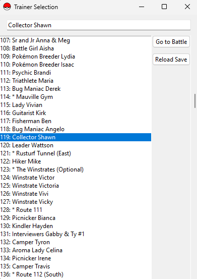
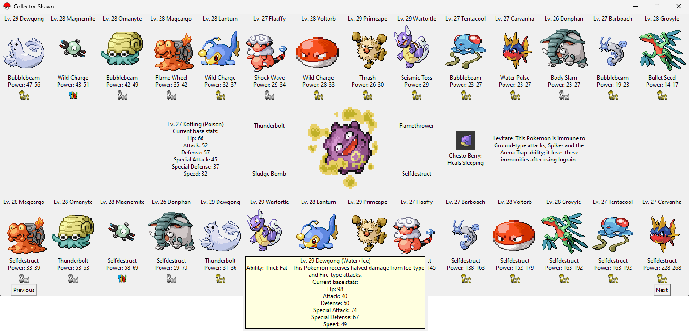

EKhelper
---------------------------
A Python-based app that should make your Emerald Kaizo experience a (little) bit easier.

EKhelper contains 2 interfaces. The first is the trainer select interface where you can choose from all possible encounters. An option to reload your save also helps not having to restart the application whenever you update your team.

The top row contains your pokemon, ordered from strongest to weakest based on their highest damaging move.

The bottom row contains your pokemon, ordered from strongest to weakest based on the opponent's highest damaging move.

By clicking on a move, you cycle to the next-best move (in this example, selfdestruct on Dewgong was clicked to show thunderbolt's damage).

By clicking on the 'previous' and 'next' buttons in the corner of the window, you can cycle through the trainer's team, updating your lists for each enemy.

"Back to trainer select" brings you back to the menu. Have fun!

What it does
---------------------------
Analyzes the target trainer pokemon versus the pokemon in your party & box.
Lists the best pokemon on your team against each target pokemon, both dealing damage against foe (top row) and taking damage from foe (bottom row). Power value is not always the true damage, as it considers the pokemon's stats, type effectivities, STAB and level while ignoring uncommon or hyper-move-specific damage modifiers (such as suffering from burn, weather-effects, earthquake-vs-dig, etc.). Keep this in mind!

_Use EKhelper as an auxiliary tool -- not a be-all and end-all program!_

Setup
---------------------------
For now, you will have to clone the repository to a local folder. Create a virtual python environment that includes PIL and openpyxl. I used Python 3.10. Then run main.py.

example using miniconda:

    conda create --name EKhelper python=3.10
    conda activate EKhelper
    conda install anaconda::pillow
    conda install openpyxl
    cd [local_folder]...
    python main.py

If you plan to use it often, I recommend creating an .exe by installing pyinstaller into your virtual environment and using that library to create a one-click app.

Update the config.txt file so that it points to your .sav file.

Data
---------------------------
Data has been curated for Emerald Kaizo specifically (this includes move power, pp, accuracy changes and pokemon base stats).

Credits
---------------------------
Interpreting save data code was taken from: https://github.com/ads04r/Gen3Save

Core Emerald Kaizo data is from the content creator PChal and his community, taken from: https://drive.google.com/drive/folders/1yfYLvI5m1QMApy55VBSrJT2C0P_HGrDM 

pokemons.json, trainer_pokemon.json, trainers.json and weather.json datasets were taken from https://ekdex.anastarawneh.com/. Many thanks!
