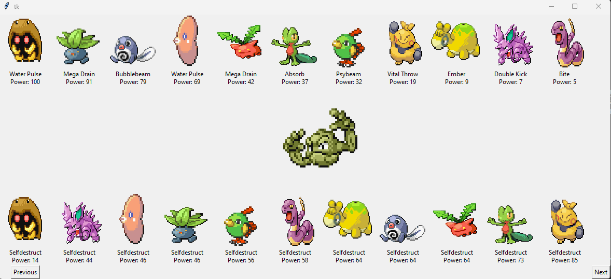
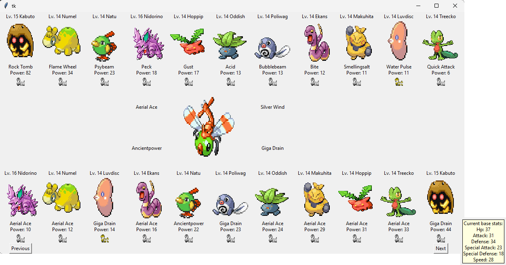

EKhelper
---------------------------
A Python-based app that should make your Emerald Kaizo experience a (little) bit easier.

In the above example, Kabuto, Poliwag and Luvdisc go first and deal enough damage to one-shot the foe's Aron. Makuhita might still one-shot, but will probably go second, making it a considerably worse pick.

In the above example, despite dealing massive damage, Kabuto is a terrible pick. It will go second, and will likely take 44 damage on an HP-bar of 37.

What it does
---------------------------
Analyzes the target trainer pokemon versus the pokemon in your party & box.
Lists the best pokemon on your team against each target pokemon, both dealing damage against foe (top row) and taking damage from foe (bottom row). Power value is not always the true damage, as it considers the pokemon's stats, type effectivities, STAB and level while ignoring uncommmon or hyper-move-specific damage modifiers (such as suffering from burn, weather-effects, earthquake-vs-dig, etc.). Take it as a relative score! 

Also, EKhelper only considers moves with a fixed base power! Moves like Magnitude or Sonic boom with varying or hp-fixed damage are listed in a seperate field on the right if the target pokemon contains said move. They are not included in the analysis.

_Use EKhelper as an auxiliary tool -- not a be-all and end-all program!_

How it works
---------------------------
- Make sure that the EK Mastersheet.txt (taken from https://drive.google.com/drive/folders/1yfYLvI5m1QMApy55VBSrJT2C0P_HGrDM) is unedited, in this folder
- When prompted in the app, enter the line number of the name of the trainer you are interested in, as it is found on the master sheet.
  - E.g. Leader Roxanne is line 218 (Use Notepad++ or similar to easily fine line number)
- A window will appear with the results, where you can click next/previous to go through the list of enemy pokemon. 
- Mouse over own pokemon to see its stats
- Mouse over enemy pokemon to see its predicted stats

Setup
---------------------------
For now, you will have to clone the repository to a local folder. Create a virtual python environment that includes PIL and openpyxl. I used Python 3.10. Then run main.py after configuring the .sav file location in-code.

example using miniconda:

    conda create --name EKhelper python=3.10
    conda activate EKhelper
    conda install anaconda::pillow
    conda install openpyxl
    cd [local_folder]...
    python main.py

If you plan to use it often, I recommend creating an .exe by installing pyinstaller into your virtual environment and using that library to create a one-click app.

Data
---------------------------
Data has been curated for Emerald Kaizo specifically (this includes move power, pp, accuracy changes and pokemon base stats). See data/gen3moves.xlsx and data/pokemon.xlsx if you are interested in these datasets specifically.

Credits
---------------------------
Interpreting save data code was taken from: https://github.com/ads04r/Gen3Save

Core Emerald Kaizo data is from the content creator PChal and his community, taken from: https://drive.google.com/drive/folders/1yfYLvI5m1QMApy55VBSrJT2C0P_HGrDM 
